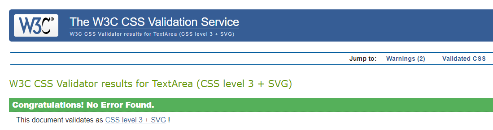

# To-Do List-Travel Planning

## Welcome to TravelTally App.

View live project here: https://travel-planning-tasks-fe7a9ec42dd1.herokuapp.com/

The ultimate companion for planning your travels with ease. Sign up, log in, and seamlessly manage your trips by adding destinations, setting travel dates, and organizing key details. With the Travel Planner App, you can ensure that every aspect of your journey is well-coordinated and stress-free.

## Index - Table of Contents

- [User Experience (UX) ](#user-experience-ux)
- [Features](#features)
- [Design](#design)
- [Technologies Used](#technologies-used)
- [Testing](#testing)
- [Deployment](#deployment)
- [Credits](#credits)

## User Experience /User Stories

## Testing and validation

### CSS

- I used the [W3 CSS Validator](https://jigsaw.w3.org/css-validator/) to check my CSS script by Direct Input. I found no errors! There are 4 warnigns which are just flagging vendor extensions.

### Python

- I used the [CI Python Linter](https://pep8ci.herokuapp.com/) to check all my python scripts. I found few errors like the below - mostly lines were too long or there was a missing blank space line. I have left some of the error messages as they are related to a too long line at the result of a comment.

## Manual Testing Results

### Home Page

| Test                                                                               | Result |
| ---------------------------------------------------------------------------------- | ------ |
| Home: Redirects to the homepage where users can view the main landing page content | Pass   |
| Sign In: It redirect to sign In page                                               | Pass   |
| Register:It redirect to register page                                              | Pass   |

### Task List Page

| Test                                             | Pass |
| ------------------------------------------------ | ---- |
| To access this required login                    | Pass |
| Add Task: It redirects to add task page          | Pass |
| View Task: It redirects to view page             | Pass |
| Edit Task: It redirects to edit the task         | Pass |
| Delete Task: It redirects to confirm delete page | Pass |

### Login Page

| Test                            | Result |
| ------------------------------- | ------ |
| Secure signup functionality     | Pass   |
| Redirect after successful login | Pass   |

### Registration Page

| Test                                   | Result |
| -------------------------------------- | ------ |
| Secure login functionality             | Pass   |
| Redirect after successful registration | Pass   |

### Logout Page

| Test                             | Result |
| -------------------------------- | ------ |
| Logout functionality             | Pass   |
| Redirect after successful logout | Pass   |

## Deployment

## Credits and Acknowledgements
