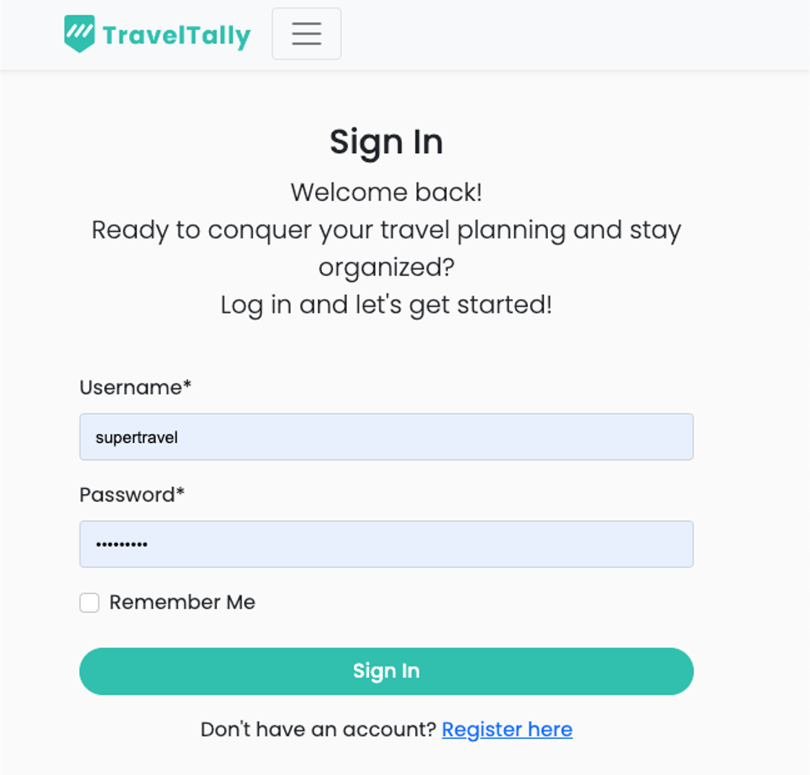
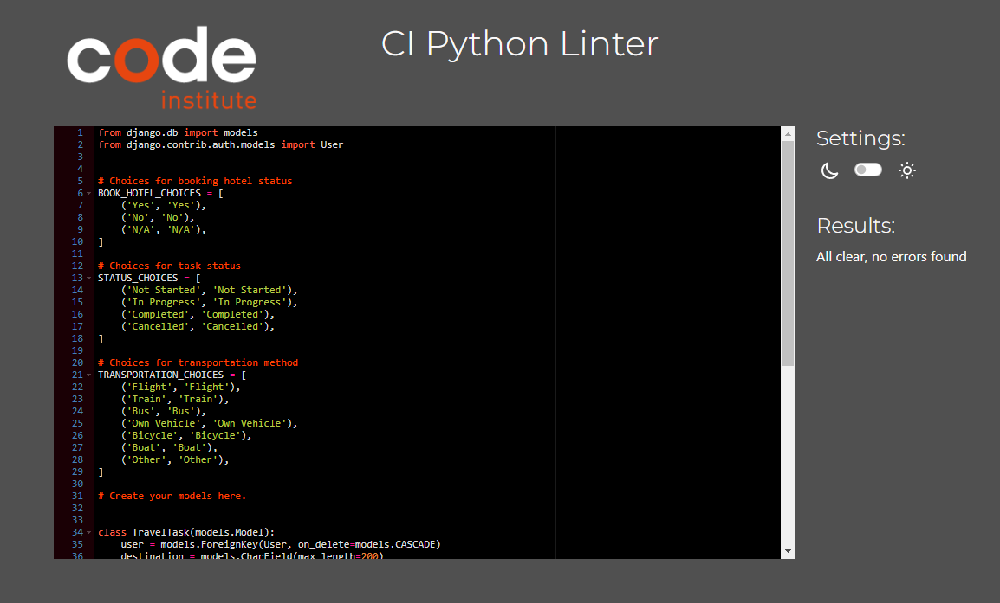

# To-Do List-Travel Planning

## Welcome to TravelTally App.

View live project here: https://travel-planning-tasks-fe7a9ec42dd1.herokuapp.com/

The ultimate companion for planning your travels with ease. Sign up, log in, and seamlessly manage your trips by adding destinations, setting travel dates, and organizing key details. With the Travel Planner App, you can ensure that every aspect of your journey is well-coordinated and stress-free.

## Index - Table of Contents

- [Target Audience](#target-audience)
- [User Experience (UX) ](#user-experience-ux)
- [Features](#features)
- [Design](#design)
- [Technologies Used](#technologies-used)
- [Testing and validation](#testing-and-validation)
- [Deployment](#deployment)
- [Credits](#credits)

### Target Audience
* **Frequent Travelers**: Individuals who need to organize multiple trips efficiently.
* **Families and Groups**: Those coordinating travel plans together.
* **Solo Travelers**: People exploring new destinations on their own.
* **Busy Professionals**: Individuals seeking a stress-free way to manage travel logistics.

## User Experience (UX)

### Database Planning
In the project, we used the Django AllAuth User Model and a custom-made model, `TravelTask`:

| Name           | Type           | Key                      |
|----------------|----------------|--------------------------|
| user           | ForeignKey     | FK to User Model         |
| destination    | CharField      |                          |
| description    | TextField      |                          |
| start_date     | DateField      |                          |
| end_date       | DateField      |                          |
| book_hotel     | CharField      | Choices: Yes, No, N/A    |
| status         | CharField      | Choices: Not Started, In Progress, Completed, Cancelled |
| transportation | CharField      | Choices: Flight, Train, Bus, Own Vehicle, Bicycle, Boat, Other |
| created_on     | DateTimeField  |                          |
| updated_on     | DateTimeField  |                          |

## User Stories Overview

## Design

### Wireframes

## Agile Development

During the development of the TravelTalley website, we implemented an Agile methodology and utilized a Kanban board on GitHub linked to our repository.

The Kanban board was organized into the following columns:
* **To Do**: This column contains user stories that are ready for development.
* **In Progress**: This column tracks user stories that are currently being worked on.
* **Done**: This column holds all the tasks that have been successfully completed.
* **Backlog**: This column includes user stories that were not prioritized for the current development cycle. These items can be revisited for future enhancements.

We applied labels with MOSCOW prioritization to categorize tasks based on their importance, and we also labeled tasks with the names of team members responsible for them. This helped ensure clarity and efficient collaboration throughout the project.

## Features

### User-Friendly Responsive Interface
* Intuitive navigation and clean design make it easy for users to manage their travel plans and tasks.
* The website is fully responsive, ensuring an optimal user experience on desktops, tablets, and mobile devices.

### User Authentication
* Secure user registration, login, and logout functionality.

### Dashboard Overview
* Upon logging in, users are presented with a dashboard that summarises their upcoming trips and tasks.
* Quick access to create, view, and manage travel tasks directly from the dashboard.

### Task Management
* Users can create, edit, and delete travel tasks associated with their trips.
* Tasks include details such as destination, start and end dates, transportation, and hotel booking status.

### Itinerary Planning
* Users can create detailed itineraries for each trip, specifying activities, accommodations, and transportation plans.
* Itineraries are displayed in an easy-to-read format, helping users stay organised during their travels.

## Features to be implemented

- **Enhanced Responsiveness**
- Conduct extensive testing of the current version to ensure it is fully responsive across all devices, including desktops, tablets, and mobile phones. This will ensure an optimal user experience for all users.

- **Advanced Itinerary Sorting**: Introduce different ways to sort travel itineraries, such as by date, by location, or by priority.

- **Travel Reminders Have**
- Implement a feature to provide users with reminders and notifications about upcoming travel tasks and deadlines.

- **Collaborative Travel Planning**
- Add functionality to allow multiple users to collaborate on the same travel itinerary, sharing tasks and plans.

## User Experience /User Stories

As a user, I want to:

- Register for the travel planning app by providing my email, name, and a password, so I can create a personalized account to manage my travel itineraries securely.
- Log in to my account using username and password, so I can access and manage my saved travel plans securely and resume planning where I left off.
- Create a new travel plan by entering details such as destination, travel dates, mode of travel, description, and status so that I can organize my trip effectively.
- Edit an existing travel plan so that I can update important details like the destination, travel dates, status, mode of travel whenever there are changes or new information. This allows me to keep my travel plans accurate and up-to-date, ensuring that everything is well-organized and reflects my current itinerary and preferences.
- View a comprehensive list of all my travel plans, including key details such as destination, travel dates and time, modes of travel, status of each trip, so I can efficiently manage my upcoming trips, track my itinerary, and prioritize the tasks that need my attention.
- Delete travel plans that are no longer relevant or have been completed, so I can maintain an organized and up-to-date list of my travel plans. This helps me keep my dashboard clutter-free and focused on my upcoming or active trips.
- The pages on the website to have consistent styling, so I can have a seamless and cohesive experience as I navigate through the site.
- the Travel Planning application to be responsive, adjusting its layout and content to fit the screen size of the device I am using, whether it's a desktop, tablet, or smartphone, ensuring an optimal user experience.

As a admin, I want to:

- Set up an initial Django project, so I can start building and organizing the application's structure.
- Outlines the website's structure and layout, so I can visualize the user flow and ensure an intuitive and user-friendly design using a wireframe.
- Experience a consistent layout and design across all pages of the website, including the navigation bar's position, styling, and behavior.

## Technologies Used
- **HTML5**: Used for structuring the web pages.
- **CSS3**: Applied for custom styling and layout designs.
- **Python**: Powers the backend of the application.
- **Django**: The web framework utilised to develop the project.
- **PostgreSQL**: Employed as the database to store and manage data.
- **Google Fonts**: Integrated for custom font styling to enhance the visual appeal.
- **Heroku**: Utilised for hosting and deploying the project.
- **Git**: Version control system used to manage code changes.
- **GitHub**: Hosts the project repositories and facilitates collaboration.
- **GitHub Project Board**: Implemented to manage tasks, track project progress, and ensure efficient workflow.
- **Figma**: Used for designing wireframes to visualise and plan the project layout.
- **Bootstrap** and **custom CSS**: Combined to create a responsive, visually appealing website tailored to project requirements.

## Testing and validation

### HTML

- I used the [W3 HTML Validator](https://validator.w3.org/) to check the HTML script validation.

### CSS

- I used the [W3 CSS Validator](https://jigsaw.w3.org/css-validator/) to check my CSS script by Direct Input. I found no errors! There are 2 warnigns which are just flagging vendor extensions.

### Python

- I used the [CI Python Linter](https://pep8ci.herokuapp.com/) to check all my python scripts. I found few errors but mostly lines were too long or there was a missing blank space line. I have left some of the error messages as they are related to a too long lines.

## Manual Testing Results

### Home Page

| Test                                                                               | Result |
| ---------------------------------------------------------------------------------- | ------ |
| Home: Redirects to the homepage where users can view the main landing page content | Pass   |
| Sign In: It redirect to sign In page                                               | Pass   |
| Register:It redirect to register page                                              | Pass   |

### Task List Page

| Test                                             | Pass |
| ------------------------------------------------ | ---- |
| To access this required login                    | Pass |
| Add Task: It redirects to add task page          | Pass |
| View Task: It redirects to view page             | Pass |
| Edit Task: It redirects to edit the task         | Pass |
| Delete Task: It redirects to confirm delete page | Pass |

### Login Page

| Test                            | Result |
| ------------------------------- | ------ |
| Secure signup functionality     | Pass   |
| Redirect after successful login | Pass   |

### Registration Page

| Test                                   | Result |
| -------------------------------------- | ------ |
| Secure login functionality             | Pass   |
| Redirect after successful registration | Pass   |

### Logout Page

| Test                             | Result |
| -------------------------------- | ------ |
| Logout functionality             | Pass   |
| Redirect after successful logout | Pass   |

### Lighthouse testing
We utilised **Lighthouse** to generate a performance report for the application, and overall, the results were very positive.

## Deployment
To deploy the TravelTalley application to Heroku, the following steps were taken, following the **Django Deployment Instructions 2024** provided by Code Institute:

**1. Repository Setup**

- **Create a New Repository:**
  - A new Git repository was created to manage the project, ensuring version control and collaboration.

- **Set up the Development Environment:**
  - The repository URL was copied into the development environment (e.g., Gitpod).
  - Django was installed, and all necessary dependencies were listed in the `requirements.txt` file.

**2. Heroku Deployment Preparation**

- **Create a Procfile:**
  - A `Procfile` was created in the project directory to specify the web server (e.g., `gunicorn`) needed for deployment.

- **Ensure Dependencies:**
  - All required dependencies were confirmed to be included in the `requirements.txt` file.

**3. Heroku Application Setup**

- **Create a Heroku App:**
  - Logged in to Heroku and created a new application, specifying a name and selecting a region.

- **Connect to GitHub:**
  - The Heroku app was connected to the relevant GitHub repository to facilitate deployment.

**4. Configuration**

- **Environment Variables:**
  - In the Heroku app settings, necessary environment variables (e.g., database URL, secret keys) were added using Config Vars to ensure secure configuration.

- **Database Integration:**
  - The application was linked to the Code Institute's PostgreSQL database on Heroku, providing a reliable data storage solution.

**5. Deployment and Launch**

- **Deploy the Application:**
  - The application was deployed by manually clicking 'Deploy Branch' on Heroku, with `DEBUG = False` to ensure a secure production environment.

- **Launch the Application:**
  - After deployment, the application was successfully launched directly from the Heroku dashboard.

## Credits

- Code Institute LMS
- [Task Manager](https://github.com/enocol/Task-Manager)
- https://github.com/Mah-N/to-do-organizer/tree/main
- [ChatGPT](https://chatgpt.com/)
- [W3 Schools](https://www.w3schools.com/)