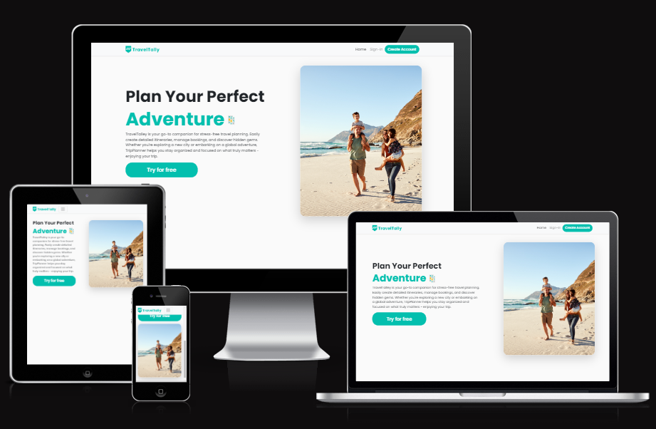

# To-Do List-Travel Planning

## Welcome to TravelTally App.

View live project here: https://travel-planning-tasks-fe7a9ec42dd1.herokuapp.com/

The ultimate companion for planning your travels with ease. Sign up, log in, and seamlessly manage your trips by adding destinations, setting travel dates, and organizing key details. With the Travel Planner App, you can ensure that every aspect of your journey is well-coordinated and stress-free.

## Index - Table of Contents

- [User Experience (UX) ](#user-experience-ux)
- [Features](#features)
- [Design](#design)
- [Technologies Used](#technologies-used)
- [Testing](#testing)
- [Deployment](#deployment)
- [Credits](#credits)

## User Experience /User Stories

As a user, I want to:

- Register for the travel planning app by providing my email, name, and a password, so I can create a personalized account to manage my travel itineraries securely.
- Log in to my account using username and password, so I can access and manage my saved travel plans securely and resume planning where I left off.
- Create a new travel plan by entering details such as destination, travel dates, mode of travel, description, and status so that I can organize my trip effectively.
- Edit an existing travel plan so that I can update important details like the destination, travel dates, status, mode of travel whenever there are changes or new information. This allows me to keep my travel plans accurate and up-to-date, ensuring that everything is well-organized and reflects my current itinerary and preferences.
- View a comprehensive list of all my travel plans, including key details such as destination, travel dates and time, modes of travel, status of each trip, so I can efficiently manage my upcoming trips, track my itinerary, and prioritize the tasks that need my attention.
- Delete travel plans that are no longer relevant or have been completed, so I can maintain an organized and up-to-date list of my travel plans. This helps me keep my dashboard clutter-free and focused on my upcoming or active trips.
- The pages on the website to have consistent styling, so I can have a seamless and cohesive experience as I navigate through the site.
- the Travel Planning application to be responsive, adjusting its layout and content to fit the screen size of the device I am using, whether it's a desktop, tablet, or smartphone, ensuring an optimal user experience.

As a admin, I want to:

- Set up an initial Django project, so I can start building and organizing the application's structure.
- Outlines the website's structure and layout, so I can visualize the user flow and ensure an intuitive and user-friendly design using a wireframe.
- Experience a consistent layout and design across all pages of the website, including the navigation bar's position, styling, and behavior.

## Testing and validation

### CSS

- I used the [W3 CSS Validator](https://jigsaw.w3.org/css-validator/) to check my CSS script by Direct Input. I found no errors! There are 4 warnigns which are just flagging vendor extensions.

### Python

- I used the [CI Python Linter](https://pep8ci.herokuapp.com/) to check all my python scripts. I found few errors like the below - mostly lines were too long or there was a missing blank space line. I have left some of the error messages as they are related to a too long line at the result of a comment.

## Manual Testing Results

### Home Page

| Test                                                                               | Result |
| ---------------------------------------------------------------------------------- | ------ |
| Home: Redirects to the homepage where users can view the main landing page content | Pass   |
| Sign In: It redirect to sign In page                                               | Pass   |
| Register:It redirect to register page                                              | Pass   |

### Task List Page

| Test                                             | Pass |
| ------------------------------------------------ | ---- |
| To access this required login                    | Pass |
| Add Task: It redirects to add task page          | Pass |
| View Task: It redirects to view page             | Pass |
| Edit Task: It redirects to edit the task         | Pass |
| Delete Task: It redirects to confirm delete page | Pass |

### Login Page

| Test                            | Result |
| ------------------------------- | ------ |
| Secure signup functionality     | Pass   |
| Redirect after successful login | Pass   |

### Registration Page

| Test                                   | Result |
| -------------------------------------- | ------ |
| Secure login functionality             | Pass   |
| Redirect after successful registration | Pass   |

### Logout Page

| Test                             | Result |
| -------------------------------- | ------ |
| Logout functionality             | Pass   |
| Redirect after successful logout | Pass   |

## Deployment

## Credits and Acknowledgements
